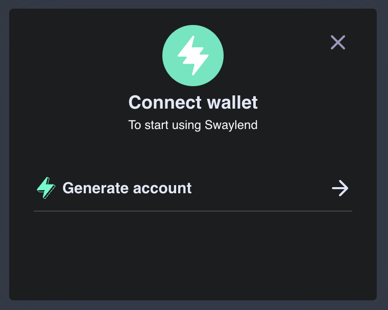

# SwayLend testnet 0.1 summary

We would like to extend our sincerest gratitude to our community for taking the time to test SwayLend and provide valuable feedback. Your help has allowed us to identify several bugs that were affecting the platform's functionality. In this article, we will provide a summary of the main bugs found and how we plan to solve them.\\

1. **Wallet generation with every new connection**\
   \
   One of the most significant bugs was a connection to our platform. This was causing many messages on how to export the account with seed phrase, how to import an already existing wallet, and how to connect Fuel Wallet to Swaylend. To resolve this issue, we will add more authentification ways like:\
   \- import account with a seed phrase\
   \- import account with the private key\
   \- connection with Fuel Wallet ( when it's possible, currently the feature in Fuel Wallet that would allow signing transactions that using our tokens is in progress)\\
2. **Response Wait Time of Transactions and Loading Data**\
   .png>)\
   \*\*\*\*One of the main bugs encountered during the testing of SwayLend was related to the response wait time of transactions and loading data from the contract. This was due to the fact that the beta2 node was busy, which impacted the performance of the platform. However, the team is already working on resolving this issue with the upcoming release of the beta3 milestone. This release will bring a new p2p system that will help to scale up full nodes, which will effectively balance API traffic and ensure the smooth operation of the platform.
3. **Supply of Tokens as Collateral**\
   A bug was encountered regarding the inability to supply some tokens as collateral in the SwayLend platform. This issue was due to a limit in the [**`supply_cap`**](../../developers/contract-methods.md) field of the Compound smart contract architecture, causing the platform to reject funds that exceeded the test configuration's limit.\
   \
   The SwayLend platform operates on the Compound smart contract architecture, where the market can be configured through various settings called in the initialization stage. One of these settings, the tokens asset\_configs field, determines how many specific collateral tokens can be used in the current market. With a large number of users, the platform's Total Value Locked (TVL) quickly reached almost 2 million, causing the supply\_cap limit to be reached.\
   \
   To resolve this issue, the team is taking two actions. Firstly, the team will change the platform's configuration to a different setting. Secondly, an explanation icon and text will be added to the collaterals token table to better inform users about the issue.\
   \
   .png>)\\
4. **Toast Notifications**\
   .png>)\
   The fourth bug was related to the toast notifications that appeared with error messages or links to transactions in the explorer. The issue was that there was no auto-delete feature after some time, which made certain parts of the screen inactive. To resolve this issue, we will add an auto-delete feature to the toast notifications so that they disappear after a set period of time, making the screen more user-friendly and accessible.
5. **Claimed Tokens Not Displayed on Account**\
   One of the issues that users faced was not being able to see the claimed tokens in their accounts after making a claim. This was due to the response time of the node which caused a delay in displaying the updated information. However, this error will be resolved as part of the solution for the response time issue, which was described in error number 2.

The **Borrow** and **Withdraw** functions of our **SwayLend** application faced some bugs which resulted in an inconsistent user experience. Our team is actively investigating the root cause of these issues and working towards resolving them as soon as possible. We will keep the community updated on any progress made and appreciate your continued support and understanding.
